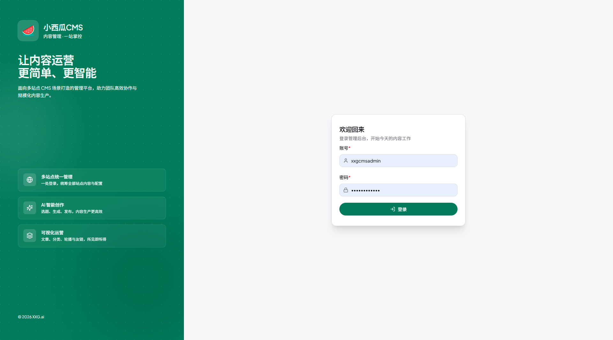
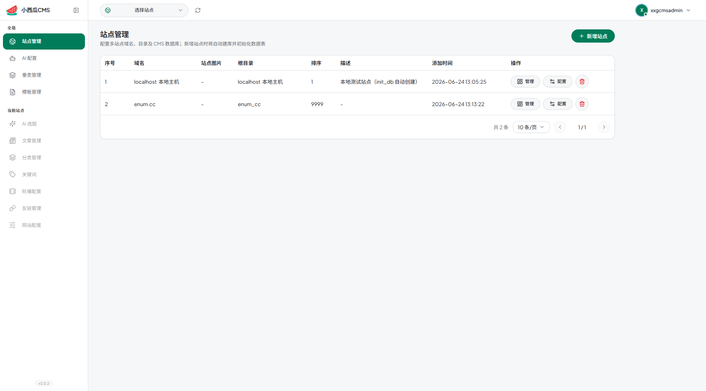
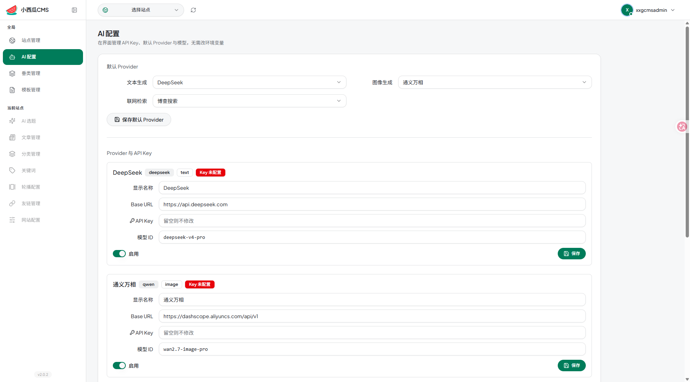
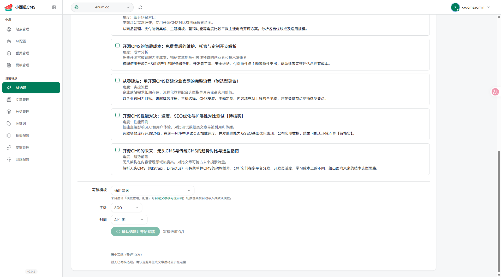

# 小西瓜CMS（xxgcms）

> **在使用本项目前，请阅读 [法律声明、使用条款与免责协议](TERMS.md)**（简要摘要见 [DISCLAIMER.md](DISCLAIMER.md)）。

## 产品简介

**小西瓜 CMS** 帮你搭建和管理内容网站——发文章、做分类、配轮播和友链，访客打开域名就能看到页面。

不用每天改代码：在浏览器里登录管理后台，像写公众号一样编辑内容，保存后前台自动更新。若你同时运营多个站点，可以在**同一个后台里切换管理**，不用反复登录不同系统。

适合个人博客、企业官网、资讯站、SEO 内容站，以及希望**数据在自己服务器上**、不依赖 SaaS 平台的用户。

## 界面预览

### 管理后台登录



### 多站点管理



### AI 服务配置



### AI 选题与成文



## 为什么选择小西瓜 CMS

| 亮点 | 对你意味着什么 |
|------|------------------|
| **开箱即用** | 装好就能登录后台发文章，首次安装会自动创建账号和数据库，省去大量手工配置 |
| **一个后台管多个站** | 多个域名、多个网站集中管理，切换站点即可编辑对应内容 |
| **AI 帮你写内容** | 输入关键词，系统自动联网找资料、推荐选题、批量写稿并配图，减轻创作压力 |
| **SEO 友好** | 支持关键词管理、专题/标签页、站点地图等，利于搜索引擎收录 |
| **老站也能迁** | 若已有 WordPress、织梦等老站数据，可同步到新系统继续用 |
| **自己掌控数据** | 内容、图片、配置都在你的服务器上，开源免费（MIT），可私有化部署 |
| **没网也能装** | 提供离线安装包，内网、机房等无法访问公网的环境也能部署 |

## 你能做什么

### 日常内容运营

- **写文章**：可视化编辑器，支持插图、摘要、封面；可存草稿、定时发布、误删可恢复
- **管栏目**：分类、首页轮播、友情链接，常用网站模块都有
- **配网站信息**：站点名称、Logo、图标、SEO 标题与描述、统计代码等，在后台一次配好
- **管关键词**：单个添加或 Excel 批量导入，并与文章自动关联，方便做专题和内链

### 让网站更容易被找到（SEO）

- 文章、列表、标签、专题等页面结构清晰，符合常见内容站习惯
- 可按标题生成更友好的链接地址
- 系统自动生成站点地图，帮助搜索引擎发现新内容

### AI 辅助创作（需自行配置 AI 服务密钥）

- **AI 选题**：输入一个核心词，系统结合网络信息推荐一批可写标题，省去「不知道写啥」的时间
- **批量写稿**：勾选感兴趣的选题，自动写正文、生成配图，成稿先进草稿箱，你审完再发布
- **按行业定制**：不同垂类（如科技、教育）可配置不同写作风格与检索方式
- 文章列表可单独查看 AI 生成的稿件，便于审核与管理

### 多站点与上线

- **新建站点**：在后台添加新网站，填好数据库信息即可自动建好内容库
- **HTTPS 证书**：可在后台上传 SSL 证书，配合域名与别名，方便站点上线
- **多套页面风格**：不同站点可选用不同前台模板，外观互不干扰

### 部署方式（给负责装服务器的人）

- **Docker 一键部署**：适合有 Docker 的环境，一条命令拉起网站全套服务
- **本地开发 / 传统部署**：也支持按文档分步安装，灵活适配现有服务器
- 详细步骤见下文「Docker 一键部署」「本地开发启动」等章节

## Docker 一键部署（推荐）

需安装 [Docker](https://docs.docker.com/get-docker/) 与 Docker Compose。

### 全栈一键部署

```bash
cp .env.docker.example .env
docker compose up -d --build
```

| 镜像 | 工程 | 说明 |
|------|------|------|
| `xxgcms/admin-backend` | `admin-backend/` | Django 管理 API（uWSGI） |
| `xxgcms/admin-frontend` | `admin-frontend/` | React 管理后台静态资源 |
| `xxgcms/website` | `website/` | Django 站点前台（uWSGI） |
| `xxgcms/nginx` | — | 私有网关（:80 入口，与其他 nginx 镜像隔离） |
| `xxgcms/mysql` | — | 私有 MySQL 8.0（2C4G 调优，应用账号 `xxgcms` + 随机密码） |

| 地址 | 说明 |
|------|------|
| http://localhost/ | 站点前台 |
| http://localhost/back-x/ | 管理后台 |
| http://localhost/api/ | 后台 API |

查看管理员凭据：

```bash
docker compose exec backend cat /app/.credentials
```

常用命令：

```bash
docker compose logs -f backend    # 查看后台日志
docker compose down             # 停止（数据保留在卷中）
docker compose down -v          # 停止并清除数据库与配置（慎用）
```

技术栈：MySQL 8 + Python uWSGI (Django) + Nginx + React 静态构建。

## 离线部署（无互联网环境）

在有网络的 Linux 机器上**一次性打包**全部镜像（MySQL、Python、Nginx 等），拷贝到离线服务器即可安装。

### 远程制作（推荐：本地 Windows + Ubuntu 构建机）

无需在本地安装 Docker，一键打包上传并在 Ubuntu 上构建：

```bash
cp scripts/offline-pack/deploy.env.example scripts/offline-pack/deploy.env
# 编辑 deploy.env：服务器 IP、用户名；密码填 REMOTE_PASSWORD（或留空用 SSH 密钥）
chmod +x scripts/build-offline-remote.sh scripts/offline-pack/*.sh
./scripts/build-offline-remote.sh
```

详见 [scripts/offline-pack/README.md](scripts/offline-pack/README.md)。

### 本地直接制作（Linux 且有 Docker）

```bash
chmod +x make-offline-bundle.sh docker/offline/bundle.sh
./make-offline-bundle.sh
```

默认打包**全栈五镜像**（约 2GB+）：

| 文件 | 内容 |
|------|------|
| `images/xxgcms-mysql.tar` | 私有 MySQL 8.0 |
| `images/xxgcms-admin-backend.tar` | admin-backend 管理 API |
| `images/xxgcms-admin-frontend.tar` | admin-frontend React 管理后台 |
| `images/xxgcms-website.tar` | website 站点前台 |
| `images/xxgcms-nginx.tar` | Nginx 统一网关 |

```bash
sudo ./install.sh
```

详细说明见 [docker/offline/README-OFFLINE.md](docker/offline/README-OFFLINE.md)。

## 本地开发启动

在 `admin-backend` 目录：

```bash
chmod +x scripts/xxgcms.sh scripts/start.sh
./scripts/xxgcms.sh install    # 首次：venv + 依赖
./scripts/xxgcms.sh setup      # 首次：配置 + 数据库 + 管理员
./scripts/xxgcms.sh start      # 启动（无 .env 时会自动 setup）
```

最短启动：

```bash
./admin-backend/scripts/start.sh          # 后台 API
./website/scripts/start.sh                # 站点前台（默认 8088）
```

管理前端开发：

```bash
cd admin-frontend && npm install && npm run dev   # http://localhost:8080
```

查看管理员账号：`./scripts/xxgcms.sh credentials`

## setup 会自动完成

1. 生成 `admin-backend/.env` 与 `website/.env`（随机密钥、数据库密码等）
2. 初始化 MySQL 8.0 库（`xxgcms` + CMS 站点库）
3. 创建管理员账号，凭据写入 `admin-backend/.credentials`

## 子项目

| 目录 | 说明 |
|------|------|
| `admin-backend/` | 后台 API，详见 [admin-backend/readme.md](admin-backend/readme.md) |
| `admin-frontend/` | 后台前端 |
| `website/` | 站点前台 |

## 敏感配置说明

- 所有密钥、密码通过 `.env` 配置，**勿提交** `.env`、`.credentials`
- 敏感项标记为 `__AUTO__` 的字段会在首次 `setup` / `init_env` 时自动随机生成
- 前台与后台共用 `XXGCMS_DB_*` 数据库连接配置（由 setup 自动同步）
- Docker 部署使用根目录 `.env`（从 `.env.docker.example` 复制）

## 法律声明与免责

使用本软件即表示您同意 [法律声明、使用条款与免责协议](TERMS.md)（版本 1.0，生效日期 2026年6月27日）。简要说明见 [DISCLAIMER.md](DISCLAIMER.md)。
